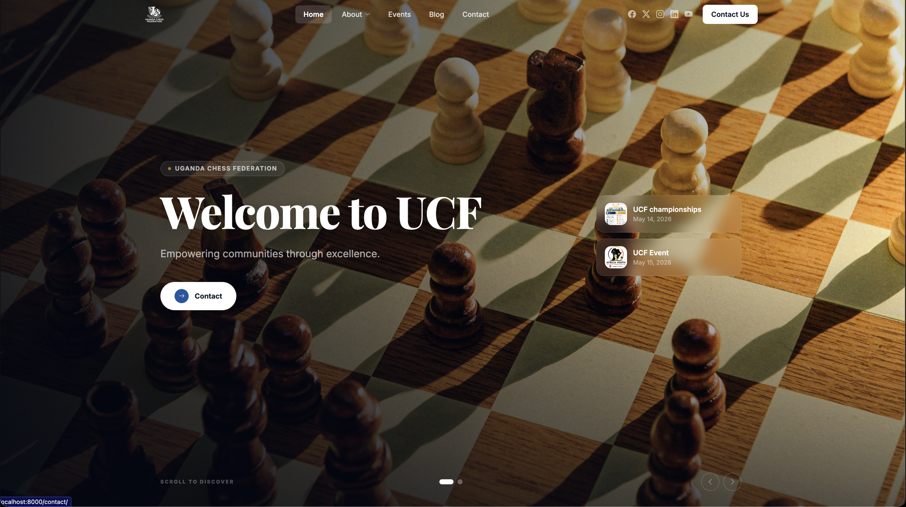
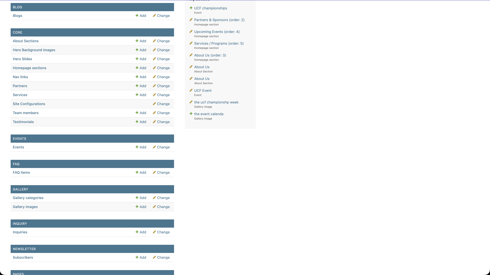
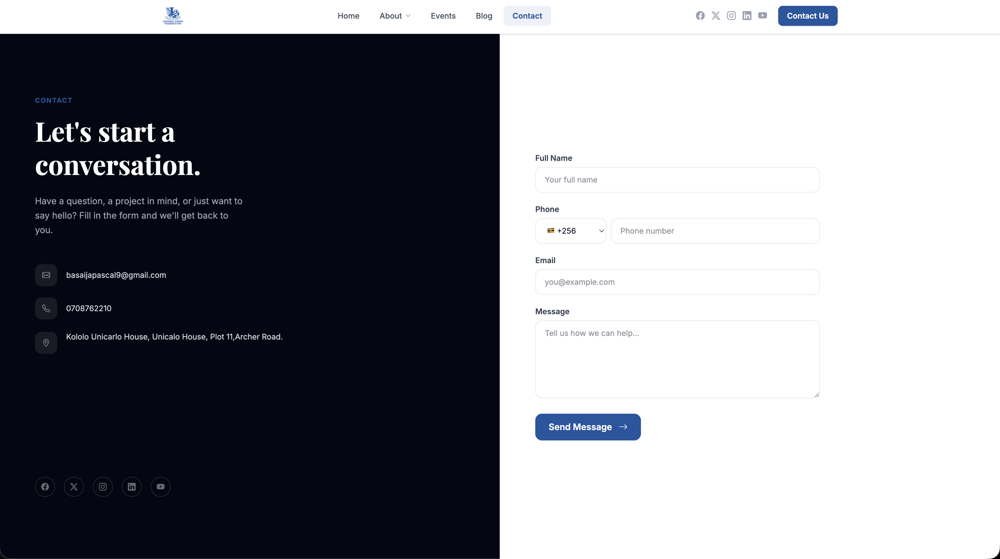

# Company Website Starter

**A cookiecutter template for building production-ready company websites with Django.**  
Generate a complete, content-managed site in minutes — no boilerplate, no wiring.




---

## What's included

| | |
|---|---|
| **Admin-driven content** | All text, images, colours, and sections controlled from the Django admin — no code deploys for content changes |
| **Homepage sections** | Hero, Services, About, Partners, Team, Events, Gallery, FAQ, Newsletter — toggle and reorder from admin |
| **Section variants** | Multiple layouts per section type; add a new variant by dropping a single HTML file |
| **Blog** | Trix rich-text editor, drafts, categories, and SEO fields |
| **Events** | Upcoming/past split with countdown timer, organizer and sponsor fields |
| **People / Profiles** | Category-based team pages (`/profiles/<category>/<person>/`) |
| **Contact form** | Split-panel design, dial-code picker, optional reCAPTCHA |
| **Composable pages** | CMS pages assembled from sections in admin |
| **SEO** | Sitemap, robots.txt, Open Graph, Google Analytics |
| **Deployment-ready** | Vercel, Railway, Render — configs included |

**Stack:** Django 5.2 · Tailwind CSS v4 · Alpine.js 3 · Bootstrap Icons

---

## Screenshots

| Homepage | Admin | Contact |
|---|---|---|
|  |  |  |

---

## Quickstart

```bash
pip install cookiecutter
cookiecutter gh:your-org/company-website-starter
```

Answer the prompts (`project_name`, `primary_color`, `author_email`), then:

```bash
cd your_project
python manage.py createsuperuser
python manage.py runserver
```

The post-generation hook handles everything else: installs deps, runs migrations, seeds `SiteConfig`, and compiles Tailwind.

---

## Manual setup

```bash
git clone <repo>
cd <project_slug>
python -m venv .venv && source .venv/bin/activate
pip install -r requirements.txt

# create .env
echo "SECRET_KEY=$(python -c 'from django.core.management.utils import get_random_secret_key; print(get_random_secret_key())')" > .env
echo "DEBUG=True" >> .env

python manage.py migrate
python manage.py loaddata fixtures/initial.json

# compile Tailwind (see bin/ for the standalone CLI)
bin/tailwindcss -i styling/static_src/input.css -o templates/css/output.css --minify

python manage.py createsuperuser
python manage.py runserver
```

---

## Customisation

**Branding** → Admin › Site Configuration (colours, logo, tagline, social links)

**Homepage layout** → Admin › Homepage Sections (enable, reorder, swap variant)

**New section variant** → create `templates/html/components/sections/<type>/<variant>.html` — it appears in admin automatically

**Tailwind watch:**
```bash
bin/tailwindcss -i styling/static_src/input.css -o templates/css/output.css --watch
```

---

## Deployment

Set these environment variables on your host:

```
SECRET_KEY=
DEBUG=False
ALLOWED_HOSTS=yourdomain.com
DATABASE_URL=postgres://...
```

Then:
```bash
python manage.py collectstatic
```

One-click deploys:

[](https://railway.app?referralCode=BfMDHP)

---

## License

MIT © 2025 Pascal Byabasaija
